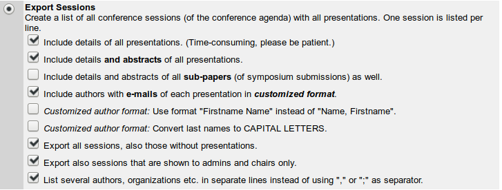

# Escop Program

Scripts to make the ESCOP program 2017

Instructions:
* export ConfTool database as csv-files 
* also export Author database
* specify correct csv-file names in `make_latex_files.py`
* run `python make_latex_files.py`
* (optinal) edit ``.*tex`` files
* run ``pdflatex program.tex``

(c) O. Lindemann, lindemann@cognitive-psychology.eu
